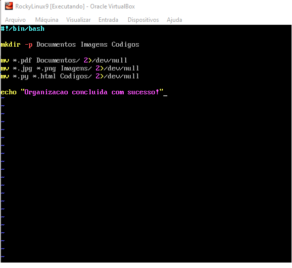
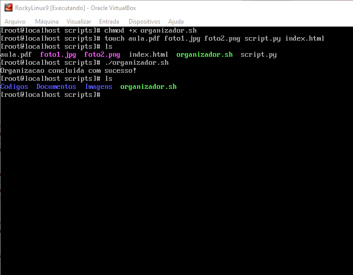

# 📁 Organizador Automático de Arquivos em Shell Script

Um script em Shell desenvolvido para automatizar a organização de diretórios bagunçados (como a pasta de Downloads), movendo arquivos automaticamente para pastas específicas com base em suas extensões.

## 🚀 Tecnologias e Ambiente

* **Sistema Operacional:** Rocky Linux 9 (ambiente homologado em máquina virtual via Oracle VirtualBox)
* **Linguagem:** Shell Script (Bash)
* **Editor de Texto:** Vim

## ⚙️ Como o Projeto Funciona

O script valida se os diretórios de destino existem (criando-os caso necessário através do comando `mkdir -p`) e, utilizando caracteres curingas (`*`), mapeia e move os arquivos sem interromper o fluxo do terminal. 

Para garantir uma execução limpa e silenciosa, o script redireciona eventuais mensagens de erro (como a ausência de um tipo específico de arquivo no momento da execução) para o dispositivo nulo do sistema (`2>/dev/null`).

### Organização dos arquivos:
* `.pdf` ➡️ Movidos para a pasta `Documentos`
* `.jpg` e `.png` ➡️ Movidos para a pasta `Imagens`
* `.py` e `.html` ➡️ Movidos para a pasta `Codigos`

---

## 🖥️ Demonstração Prática

### Código-Fonte do Script
Abaixo está a estrutura do script desenvolvido e editado diretamente no terminal utilizando o Vim:



### Ciclo de Execução e Validação
O print abaixo demonstra o ciclo completo de funcionamento do projeto no Rocky Linux:
1. **Permissão:** Atribuição de permissão de execução ao script com `chmod +x`.
2. **Cenário Inicial:** Criação de arquivos de teste variados (`.pdf`, `.jpg`, `.png`, `.py`, `.html`) usando o comando `touch` e listagem da pasta bagunçada com `ls`.
3. **Execução:** Execução do script `./organizador.sh` exibindo a mensagem de sucesso.
4. **Cenário Final:** Nova listagem com `ls` comprovando a criação automática das pastas e a movimentação correta de cada arquivo.



---

## 🛠️ Como Executar o Projeto

1. Clone o repositório ou crie o arquivo localmente em seu ambiente Linux:
   ```bash
   vim organizador.sh
